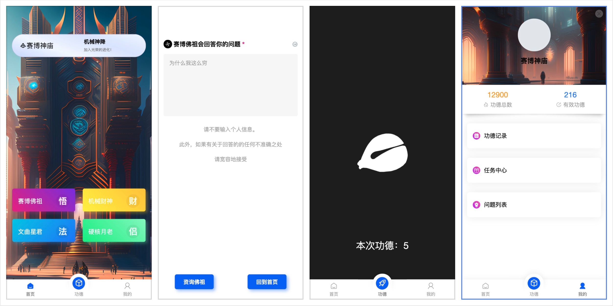

# 赛博神庙

敲电子木鱼，修赛博功德，拜机械佛祖。

## 截图



## 说明

使用 Python + uni-app 开发。后端接入了 chatgpt 进行问答。这里开源的是前端代码，后端接口写在了私人项目中，不便于开源，接口内容比较简单，可以自己用擅长的语言重写。

数据表如下：

```python
class Base(BaseModel):
    __abstract__ = True

    id = Column(Integer(), primary_key=True)
    create_time = Column(DateTime(), default=datetime.now, comment='添加时间')
    update_time = Column(DateTime(), comment='更新时间')

    @declared_attr
    def __tablename__(cls):
        return cls.__name__.lower()

    def as_dict(self, exclude=None) -> dict:
        if exclude is None:
            exclude = {}
        res = dict()
        for c in inspect(self).mapper.column_attrs:
            if c.key in exclude:
                continue
            res[c.key] = getattr(self, c.key)
        return res


class UserModel(Base):
    """用户"""

    openid = Column(String(128), nullable=False, comment='OpenID', unique=True)
    merits = Column(Integer(), default=0, comment="功德总数")
    can_use_merits = Column(Integer(), default=0, comment="可用功德")


class UserQuestionModel(Base):
    """问题记录"""

    openid = Column(String(128), nullable=False, comment='OpenID')
    question = Column(String(255), nullable=False, comment="用户提问")
    answer = Column(Text(), nullable=False, comment="答案")


class MeritsRecordModel(Base):
    """功德表"""

    openid = Column(String(128), nullable=False, comment='OpenID')
    count = Column(Integer(), default=0, comment="数量")
    m_type = Column(Integer(), default=0, comment="功德类型, 1: in, 2: out")
    remark = Column(String(), comment="备注")
```

### 电子木鱼

限制一秒最多一次

10功德=1祈祷/提问

### 赛博佛祖 - 悟

你将扮演佛祖，站在佛祖的角度，使用温和的语气，帮我解答 我不知道生存的目的

### 机械财神 - 财

你将扮演财神，使用机械神降的风格，回应我的祈祷 希望我通过个人项目赚100w

### 硬核月老 - 侣

你将扮演月老，使用赛博朋克风格的语气，帮我解答 希望我可以和Cocos一直在一起

### 文曲星君 - 法

你将扮演文曲星君，使用鼓励的语气，回应信众的祈祷   希望张三今年能考上清华大学

### 任务

#### 签到

签到 = 10 功德

#### 邀请

邀请好友 = 100功德

### 开发任务

- [x] 首页
- [x] 咨询页面
	- [x] 不同的id对应不同的页面显示
- [x] 功德页面
	- [x] 功德点击限制
	- [x] 功德上报（不上报不记入资产）
- [ ] 我的页面
	- [ ] 问题列表
	- [ ] 功德记录
	- [ ] 任务列表

#### 前端
	页面隐藏之后自动上报功德
#### 后端
	记录一个上报日志，并将功德记入用户账户

## 运行

前端使用 uni-app 进行开发，使用 HBuilderX 进行开发或者运行到微信开发者工具即可。


## 其他

[图鸟 UI](https://vue2.tuniaokj.com/)


## License

[MIT](https://choosealicense.com/licenses/mit/)


